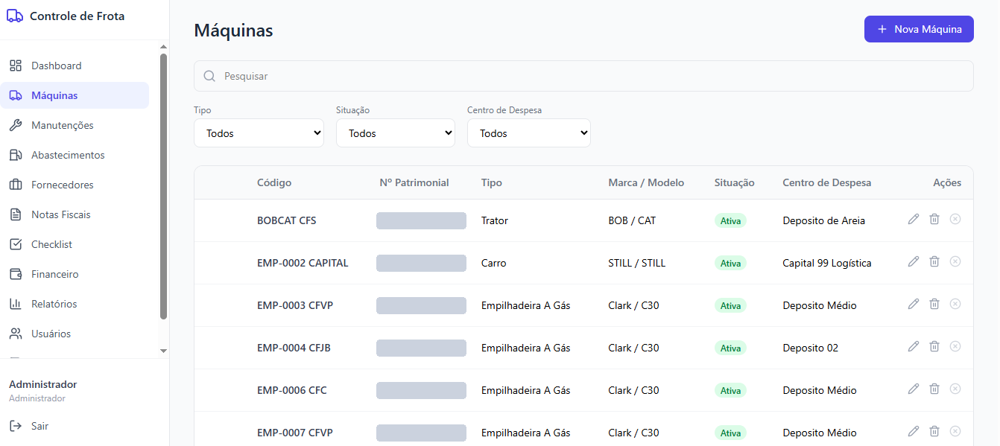
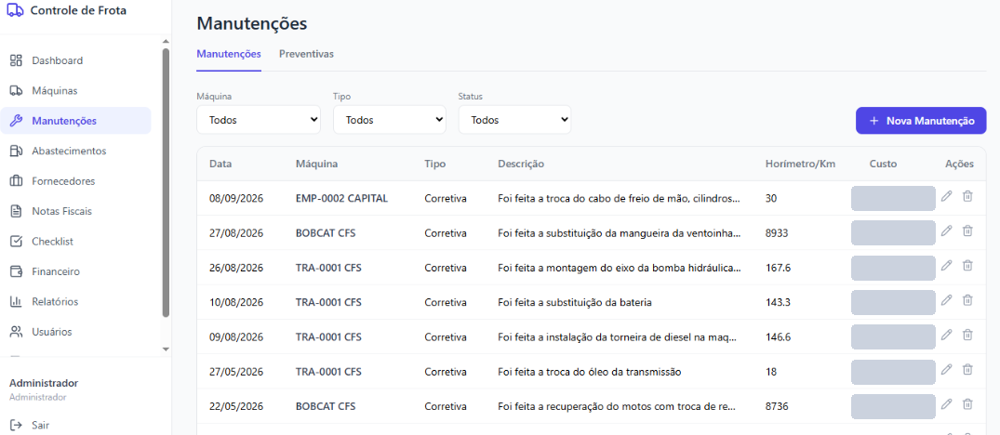
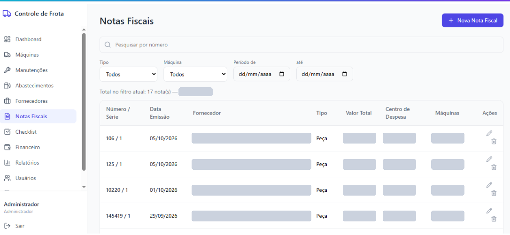

# Gestão de Frota

> **Área:** Logística · **Meu papel:** produto e desenvolvimento, do documento de requisitos à produção · **Status:** em produção

## Contexto

A empresa opera uma frota mista: empilhadeiras, tratores e veículos, distribuídos entre filiais. Manutenção, abastecimento, notas fiscais e peças eram controlados em lugares diferentes.

## Problema

- Não havia uma visão única de **quanto cada máquina custa**.
- A manutenção era **reativa**: a máquina parava e só então entrava na oficina.
- O estoque de peças não conversava com as notas de compra nem com as manutenções.
- Diretoria, mecânicos e administrativo precisavam de coisas diferentes do mesmo dado.

## Discovery

O projeto partiu de um documento de requisitos da área de Logística. A partir dele, mapeei quem usa o sistema e o que cada um precisa ver:

| Perfil | O que precisa | O que o sistema entrega |
|---|---|---|
| **Mecânico** | Registrar rápido, no pátio, pelo celular | Manutenções, abastecimentos e checklist, em telas para celular |
| **Diretor** | Enxergar custo e decidir | Dashboard, financeiro e relatórios, somente leitura |
| **Administrador** | Controlar tudo | Acesso completo, usuários e permissões |
| **Observador** | Conhecer o sistema | Modo demonstração |

## Decisões de produto

| Decisão | Por quê |
|---|---|
| **Perfis com telas diferentes**, e não uma tela com permissões | Cada pessoa vê só o que usa; o mecânico não navega por finanças |
| **Estoque ligado à nota fiscal e à manutenção** | A entrada da nota soma no estoque; a manutenção baixa. Sem estoque, a manutenção não é registrada |
| **Importação do XML da NF-e** | Elimina a digitação de itens e cadastra o produto automaticamente |
| **Checklist de inspeção** | Transforma manutenção reativa em preventiva |
| **Log central de auditoria** | Toda alteração tem autor e data |
| **Celular em primeiro lugar para o mecânico** | É onde o dado nasce; se for difícil registrar, o dado não existe |

## Solução

Módulos em produção: máquinas, fornecedores, notas fiscais, manutenções, abastecimentos, checklist, estoque, financeiro, relatórios, logs e gestão de usuários.

**Máquinas.** Cadastro único da frota mista, com situação e centro de despesa de cada equipamento.

**Manutenções.** Histórico por máquina, com horímetro ou quilometragem, e aba separada para as preventivas.

**Notas fiscais.** Cada nota fica ligada ao fornecedor, ao centro de despesa e às máquinas que receberam as peças.

## Resultados

- Gastos, medições e manutenções de toda a frota em um só lugar.
- Estoque de peças atualizado pelas próprias notas e manutenções, sem lançamento duplicado.
- 15 máquinas e veículos cadastrados, de 4 tipos: trator, carro, empilhadeira a gás e empilhadeira elétrica.

## Aprendizados

- **Perfil de acesso é decisão de produto, não só de segurança.** Desenhar por perfil simplificou cada tela.
- **A regra de estoque deu trabalho e valeu.** Bloquear a manutenção sem peça em estoque força o dado a ficar correto.

## Próximos passos

- Módulo de filiais, para acompanhar custo por unidade.
- Relatórios e análises mais completos para a diretoria.

---

As telas mostram o sistema real, com valores, fornecedores e números patrimoniais cobertos.

## Stack

React · FastAPI (Python) · PostgreSQL (Supabase) · Vercel
