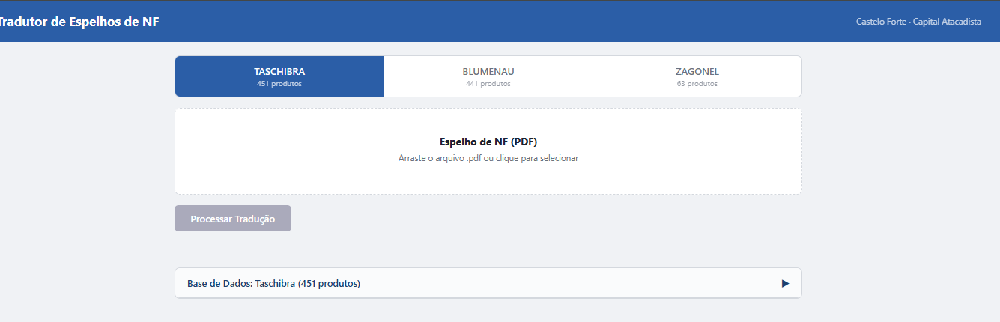
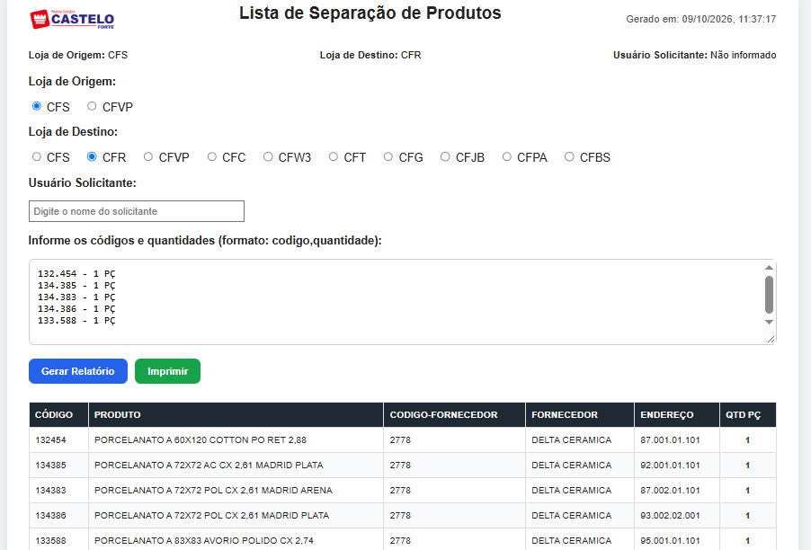

# Outras entregas

Nem toda melhoria precisa de um produto novo. Estas são ferramentas pequenas, feitas para tirar uma tarefa repetitiva do dia de alguém da operação.

| Ferramenta | Área | Como era | Como ficou |
|---|---|---|---|
| [**Tradutor de espelho**](#tradutor-de-espelho) | Devolução de mercadorias | Os dados do espelho do fornecedor eram redigitados para montar a devolução | A pessoa envia o PDF e o documento é convertido para o padrão interno, sem redigitação |
| [**Separação de pisos entre filiais**](#separação-de-pisos-entre-filiais) | Logística e lojas | A lista de separação era montada à mão, consultando produto, fornecedor e endereço de cada código | A pessoa informa código e quantidade; a ferramenta gera a lista pronta para imprimir |

---

## Tradutor de espelho

### O que é

Quando a empresa devolve mercadoria a um fornecedor, o fornecedor envia antes um **espelho da nota fiscal**: um PDF com os itens, as quantidades e os valores que a nota de devolução deve ter. O problema é que o espelho vem com os **códigos de produto do fornecedor**, e o sistema da empresa trabalha com os **códigos internos**. O tradutor faz essa conversão.

### Como era

Alguém abria o PDF, procurava cada item no cadastro para descobrir o código interno correspondente e redigitava tudo. Em uma devolução com dezenas de itens, era lento e fácil de errar um código ou uma quantidade.

### Como funciona

1. A pessoa escolhe o fornecedor.
2. Arrasta o PDF do espelho para a tela.
3. A ferramenta lê os itens do PDF e localiza cada um na base de produtos daquele fornecedor.
4. O resultado sai com os códigos internos, pronto para ser usado na devolução.

Cada fornecedor tem a sua própria base de correspondência, porque cada um usa um padrão de código e um formato de documento diferentes.

### Decisões

- **Resolver só a conversão.** Não tentei automatizar a devolução inteira. A conversão era a etapa que mais consumia tempo e a de menor risco.
- **Uma base por fornecedor.** Em vez de uma regra genérica, cada fornecedor tem o próprio mapeamento. Dá mais trabalho para incluir um fornecedor novo, mas a tradução fica confiável.
- **Começar pelos fornecedores de maior volume de devolução.**

### Resultado

- 3 fornecedores atendidos e 955 produtos mapeados.
- Fim da redigitação de itens e dos erros de código que vinham com ela.

---

## Separação de pisos entre filiais

### O que é

Quando uma loja precisa de pisos que estão no estoque de outra, alguém na loja de origem tem de **separar** esses itens para o envio. Para isso, precisa de uma lista dizendo o que pegar, quanto e **em que endereço do depósito** cada item está. A ferramenta gera essa lista.

### Como era

A lista era montada à mão. Para cada código pedido, a pessoa consultava o produto, o fornecedor e o endereço no estoque, e passava tudo para uma folha. Quanto mais itens, mais consultas, e um endereço errado significava alguém procurando piso no corredor errado.

### Como funciona

1. A pessoa seleciona a loja de origem e a loja de destino.
2. Informa quem está solicitando.
3. Cola os códigos e as quantidades, um por linha.
4. A ferramenta cruza cada código com a base da loja de origem e monta a tabela com produto, código do fornecedor, fornecedor, endereço e quantidade.
5. A lista é impressa com cabeçalho de origem, destino, solicitante, data e hora.

### Decisões

- **A base muda conforme a loja de origem.** O mesmo piso fica em endereços diferentes em cada loja, então a lista só faz sentido se usar o estoque de quem vai separar.
- **Entrada por colagem de texto.** Quem pede já tem os códigos em uma mensagem ou planilha. Colar várias linhas de uma vez é mais rápido do que preencher um formulário item por item.
- **Saída pensada para papel.** Quem separa está no depósito, com a folha na mão, e não na frente de um computador.

### Resultado

- 2 lojas de origem e 10 lojas de destino atendidas.
- Lista completa gerada em segundos, com o endereço de cada item.

### Próximo passo

Romaneio geral: somar várias listas em uma só, para a expedição conferir o total que sai no caminhão.

---

## O que estas entregas mostram

Produto interno também é manutenção contínua da operação: ouvir onde o tempo está sendo perdido e resolver com o menor recorte possível.

## Stack

JavaScript · HTML/CSS · Vercel
